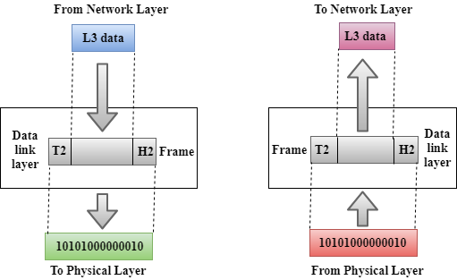

- Pengertian
	- **WHAT** Model OSI (Open System Interconnection) Menyediakan kerangka logika terstruktur bagaimana proses komunikasi data berinteraksi melalui jaringan.
	- **WHO** Diciptakan oleh International Organization for Standardization (ISO)
	- **WHEN and WHERE** Di Eropa pada tahun 1977
	- **WHY** agar terbentuknya komunikasi jaringan komputer yang lebih luas walaupun berbeda vendor atau produsen. Kerena sebelum dibentuknya OSI layer ini, komunikasi jaringan komputer sangat bergantung pada vendor atau produsen sehingga komunikasi jaringan pun sangat terbatas
- Cara Kerja
  collapsed:: true
	- 
	- Informasi berawal dari layer Application. Informasi kemudian melewati layer presentation dan layer session. Pada tahap ini biasanya belum dilakukan transformasi data. Informasi yang melalui ketiga layer ini disebut PDU (Protocol Data Unit) atau data saja.
	- Setelah sampai di layer Transport, data akan mengalami transformasi ke bentuk lain yang disebut segmen.
	- Segmen mengalir ke layer network dan kemudian diubah menjadi packet.
	- Packet mengalir ke layer data link dan kemudian diubah menjadi frame.
	- Terakhir, frame mengalir ke layer physical dan kemudian diubah menjadi bits atau bit-bit. Pada layer ini, bit-bit diubah menjadi besaran fisik, seperti arus listrik, gelombang elektromagnetik, dan sebagainya.
- Layer Layer
	- Ilustrasi Alur Kerja
	  collapsed:: true
		- 
	- Upper Layer: Bertanggung Jawab Terhadap **Host** <ins></ins>
		- Application Layer
			- Menyediakan user interface
			- Protokol
				- DNS(Domain Name System) 
				  collapsed:: true
					- berjalan pada port 53
					- melakukan address mapping.
					- Layanan Web Browser, Email.
					- www.detik.com dengan IP 192.120.230.12
					- Rawan oleh serangan poisoning dan jika salah konfigurasi dapat disalahgunakan untuk melakukan zone full transfer.
				- FTP(File Transfer Protocol) 
				  collapsed:: true
					- Merupakan standar untuk pentransferan berkas seperti melakukan pengunduhan (download) dan penggugahan (upload) berkas-berkas komputer antara klien FTP dan server FTP.
					- Serangan pada layanan ini bisa berupa eksploitasi kesalahan konfigurasi directory permission dan atau sniffing password yang berbentuk cleartext.
				- DHCP (Dynamic Host Configuration Protocol)  
				  collapsed:: true
					- Memudahkan pengalokasian alamat IP dalam suatu jaringan
					- dipasang di jaringan lokal, maka semua komputer yang tersambung di jaringan akan mendapatkan alamat IP secara otomatis
					- disampaikan kepada client yang berisikan informasi tentang konfigurasi jaringan.
				- SMTP (Simple Mail Transfer Protocol)
				  collapsed:: true
					- protokol yang umum digunakan untuk pengiriman surat elektronik (e-mail) di Internet.
					- berfungsi untuk mengirimkan pesan-pesan e-mail dari e-mail klien ke e-mail server, mengirimkan e-mail kepada lokal account, dan menyiarkan ulang e-mail antara server-server SMTP.
				- HTTP/S
					- Mentransfer dokumen dalam World Wide Web web browser
					- berfungsi menjawab antara client dan server, dan membuat hubungan TCP/IP ke port tertentu di host yang jauh.
				- Telnet
			- 
		- Presentation Layer
			- Menyajikan data dan menangani proses seperti enkripsi data
			- Protokol
				-
			- 
		- Session Layer
		  collapsed:: true
			- Memisahkan data dari berbagai aplikasi
			- 
		- Transport Layer
		  collapsed:: true
			- Menyediakan reliable atau unreliable delivery dan mengecek error connection sebelum transmisi data
			- 
	- Lower Layer: Bertangung Jawab Terhadap **Network**
		- Network Layer
		  collapsed:: true
			- Menyediakan logical addressing dan menentukan rute menuju tujuan
			- 
		- Data Link Layer
		  collapsed:: true
			- Menyediakan akses ke media menggunakan MAC Address dan melakukan error detection
			- 
		- Phisical Layer
		  collapsed:: true
			- Menentukan tegangan, kecepatan, besaran fisik, dan mengalirkan bit-bit antar device
			- 
	- **Selesai**
- **Referensi Artikel**
	- [Pengertian, Fungsi dan Macam Macam OSI Layer Part 1](https://onlinelearning.binus.ac.id/computer-science/post/7-osi-layer)
	- [Pengertian, Fungsi dan Macam Macam OSI Layer Part 2](https://www.javatpoint.com/osi-model)
	- [Pengertian, Fungsi dan Macam Macam OSI Layer Part 3](https://www.sekawanmedia.co.id/blog/osi-layer/)
	- [Pengertian, Fungsi dan Macam Macam OSI Layer Part 4](https://www.nesabamedia.com/pengertian-osi-layer/)
	- [Kumpulan Soal Berserta Jawaban Tentang OSI Layer](https://seputarinfotech.blogspot.com/2021/03/contoh-soal-dan-jawaban-osi-layer.html)
	- [Serangan Pada Model OSI](https://akhmadkun.wordpress.com/2012/11/05/hacking-serangan-pada-model-osi/)
	- [Protokol pada Aplication Layer](http://lea.si.fti.unand.ac.id/2013/12/protocol-pada-application-layer/)
	- [Threat of OSI Model](https://training.nhlearninggroup.com/blog/7-layers-of-cybersecurity-threats-in-the-iso-osi-model)